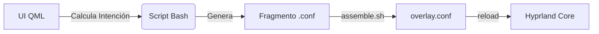

# 🦉 Noctalia Visual Layer
### El Controlador Estético Definitivo para Hyprland


**Noctalia Visual Layer (NVL)** es un ecosistema de personalización dinámica y no destructiva para **Hyprland** y **Noctalia Shell**, desarrollado con **Quickshell (QML)** y **Bash**. Permite cambiar animaciones, bordes, shaders y geometría al instante, sin riesgo de corromper la configuración principal del usuario.

---

## ✨ Características Principales

| Característica | Descripción |
| :--- | :--- |
| **🛡️ Arquitectura No-Destructiva** | NVL nunca toca tu configuración personal. Trabaja sobre una capa superior encapsulada. |
| **⚡ Aplicación Instantánea** | La lógica reactiva aplica cualquier cambio en milisegundos, sin necesidad de recargar. |
| **🎬 Biblioteca de Movimiento** | Desde la suavidad de *Seda* hasta la agresividad de *Cyber Glitch*. |
| **🎨 Bordes Inteligentes** | Degradados dinámicos y efectos reactivos al foco de la ventana. |
| **🕶️ Shaders en Tiempo Real** | Filtros de post-procesado (Noche, CRT, Monocromo, OLED) aplicados al vuelo. |
| **🌍 Internacionalización** | Soporte nativo multilingüe. El sistema se adapta a tu idioma automáticamente. |

---

## 📂 Estructura del Proyecto

```text
noctalia-visual-layer/
├── manifest.json           # Metadatos y definición del plugin
├── BarWidget.qml           # Punto de entrada: Botón disparador en la barra
├── Panel.qml               # Interfaz principal (Contenedor de módulos)
├── overlay.conf            # ARCHIVO MAESTRO (Sourced por Hyprland)
│
├── modules/                # Lógica de la Interfaz (QML)
│   ├── WelcomeModule.qml   # Panel de bienvenida y persistencia
│   ├── BorderModule.qml    # Selector de estilos y colores
│   └── ...                 # Otros módulos (Animation, Shader, etc.)
│
├── assets/                 # El "Motor" y Recursos
│   ├── nvl-colors.conf     # DINÁMICO: Colores procesados con Alpha (Mustache)
│   ├── borders/            # Biblioteca de estilos (.conf)
│   ├── animations/         # Biblioteca de curvas de movimiento (.conf)
│   ├── shaders/            # Filtros de post-procesado (.frag)
│   ├── fragments/          # Estado actual (Simlinks de los estilos activos)
│   └── scripts/            # Bash Engine (Ensamblado y lógica de aplicación)
│
└── i18n/                   # Traducciones (Soporte multi-idioma)

```

---

## 🚀 Instalación y Activación

Es necesario tener **Noctalia Shell** y **Hyprland** para poder utilizar este plugin. Aquí tienes los pasos exactos para su correcta instalación:

1. Descarga este repositorio en la ruta `~/.config/noctalia/plugins/`.
2. Una vez tengas el plugin en la ruta correcta, debes ir a la **Configuración** de Noctalia Shell e ir al apartado de **Plugins**, donde debería aparecer en la lista de instalados para poder activarlo. Una vez activo, debe aparecer en la barra de Noctalia. 
3. Una vez dentro del panel, para que las modificaciones funcionen, debes activar el interruptor **"Habilitar Visual Layer"**.

> [!NOTE]
> Al activarlo, el sistema inyectará automáticamente una línea segura (`source = .../overlay.conf`) en tu `hyprland.conf`. Al apagarlo, limpiará tu configuración dejándola en su estado original.

---

## 🧠 Arquitectura Técnica (El Sistema de Fragmentos)

A diferencia de otros gestores que editan archivos estáticos, NVL utiliza un flujo de **construcción dinámica**:

1. **Escaneo Dinámico:** El script `scan.sh` extrae metadatos directamente de los comentarios en los archivos de `assets/`.
2. **Generación de Fragmentos:** Al seleccionar un estilo en QML, se clona en `assets/fragments/`.
3. **Ensamblaje:** `assemble.sh` unifica todos los fragmentos activos.
4. **Inyección:** Se genera el `overlay.conf` y Hyprland lo recarga al instante.



---

## 🛠️ Guía de Modding (Protocolo de Metadatos)

Para añadir tus propios archivos y que aparezcan en el panel automáticamente, usa este formato en la cabecera:

### Para Animaciones y Bordes (`.conf`)

```ini
# @Title: Mi Estilo Épico
# @Icon: rocket
# @Color: #ff0000
# @Tag: CUSTOM
# @Desc: Una descripción breve de tu creación.

general {
    col.active_border = rgb(ff0000) rgb(00ff00) 45deg
}

```

### Para Shaders (`.frag`)

```glsl
// @Title: Filtro Vision
// @Icon: eye
// @Color: #4ade80
// @Tag: NIGHT
// @Desc: Descripción del post-procesado.

void main() { ... }

```

### 🎨 Iconografía

El sistema utiliza **Tabler Icons**. Para añadir nuevos iconos, consulta el catálogo en [tabler-icons.io](https://tabler-icons.io/) y usa el nombre exacto (ej. `brand-github`, `bolt`).

---

## ⚠️ Solución de Problemas

**El panel muestra exclamaciones `!!text!!` en un estilo.**

* El sistema no encuentra la traducción oficial. Si persiste, el sistema usará el texto de respaldo de tu archivo automáticamente (Fallback seguro).

**He creado un estilo propio y Hyprland da error.**

* NVL aísla los errores en `overlay.conf`. Si un estilo no carga, revisa la sintaxis de código de tu archivo personal.

**Las animaciones de los bordes se detienen y no giran en bucle.**

* Es una limitación conocida del motor de Hyprland al recargar la configuración en caliente sobre ventanas que ya están dibujadas en pantalla. Para solucionarlo de inmediato, basta con reabrir la ventana afectada. De todos modos, este detalle se irá disipando por sí solo a medida que abras nuevas ventanas durante tu flujo de trabajo, y funcionará de manera impecable y global la próxima vez que inicies sesión.

---

## ❤️ Créditos y Autoría

* **Arquitectura & Core:** Ximo
* **Asistencia Técnica:** Co-programado con IA (Gemini - Google)
* **Inspiración:** HyDE Project & JaKooLit.
* **Comunidad:** Gracias a todos los usuarios de Noctalia.
